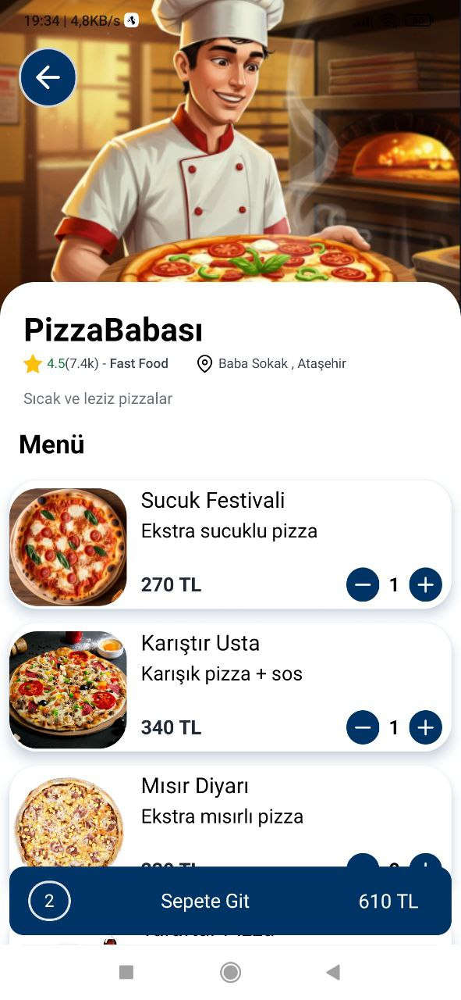
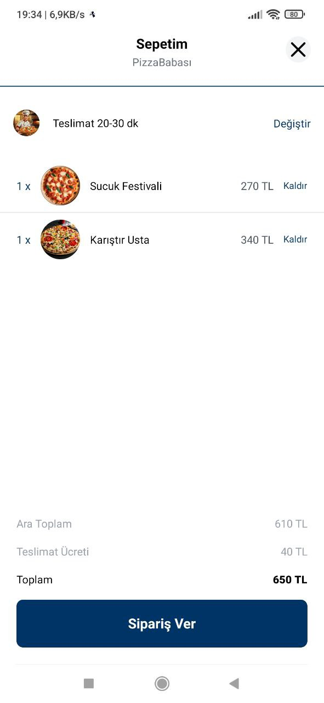
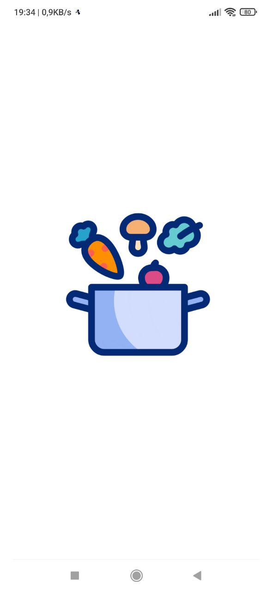
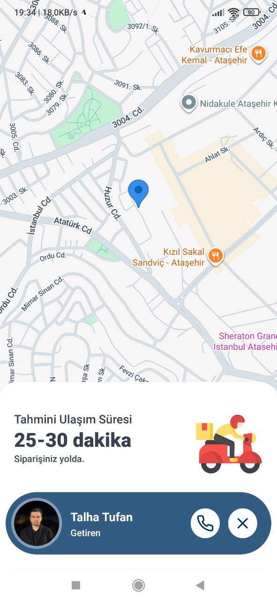

# Yemeğimi Getir 🍔🍕🚀

A beautiful and modern React Native food delivery application built with **Expo**, **Nativewind (TailwindCSS)**, **Redux Toolkit**, and **Sanity CMS**.


## ✨ Features

- **Modern UI/UX**: Clean, intuitive and responsive interface designed with Nativewind.
- **Dynamic Content**: Data fetched from Sanity CMS (Restaurants, Categories, Featured lists).
- **State Management**: Robust cart logic and restaurant selection handled using Redux Toolkit.
- **Navigation**: Fluid screen transitions with React Navigation.
- **Maps Integration**: Real-time delivery tracking using React Native Maps.
- **Animations**: Engaging feedback during cart updates and order preparation.
- **Cross-Platform**: Runs seamlessly on both iOS and Android.

## 📸 Screenshots

Here is a glimpse into the flow of the app:

<div style="display: flex; flex-direction: row; flex-wrap: wrap; gap: 10px;">
  
  
  
  
  
</div>

## 🛠️ Tech Stack

- **Frontend**: React Native, Expo (SDK 54)
- **Styling**: Nativewind (Tailwind CSS for React Native)
- **State Management**: Redux Toolkit, React-Redux
- **Backend/CMS**: Sanity CMS
- **Icons**: @expo/vector-icons
- **Maps**: react-native-maps

## 🚀 Getting Started

To get a local copy up and running, follow these simple steps.

### Prerequisites

You need to have Node.js and npm installed on your machine.

- npm
  ```sh
  npm install npm@latest -g
  ```

### Installation

1. Clone the repo
   ```sh
   git clone https://github.com/TalhaTufanN/react-native-yemegimi-getir.git
   ```
2. Install NPM packages
   ```sh
   npm install
   ```
3. Start the Expo development server
   ```sh
   npx expo start
   ```

## 📂 Project Structure

- `/components` - Reusable UI components like `RestaurantCard`, `DishRow`, `Categories`, etc.
- `/screens` - Main app screens: `HomeScreen`, `RestaurantScreen`, `CartScreen`, `OrderPreparingScreen`, `DeliveryScreen`.
- `/slices` - Redux state slices for the cart and restaurant.
- `/sanity` - Configuration and schemas for the Sanity backend.
- `/theme` - Global color themes and UI configuration.
- `/assets` - Static images, icons, and screenshots.

## 🤝 Contributing

Contributions are what make the open source community such an amazing place to learn, inspire, and create. Any contributions you make are **greatly appreciated**.

1. Fork the Project
2. Create your Feature Branch (`git checkout -b feature/AmazingFeature`)
3. Commit your Changes (`git commit -m 'Add some AmazingFeature'`)
4. Push to the Branch (`git push origin feature/AmazingFeature`)
5. Open a Pull Request

## 📝 License

Distributed under the MIT License. See `package.json` for more information.

---

_Developed by [Talha Tufan](https://github.com/TalhaTufanN)_
